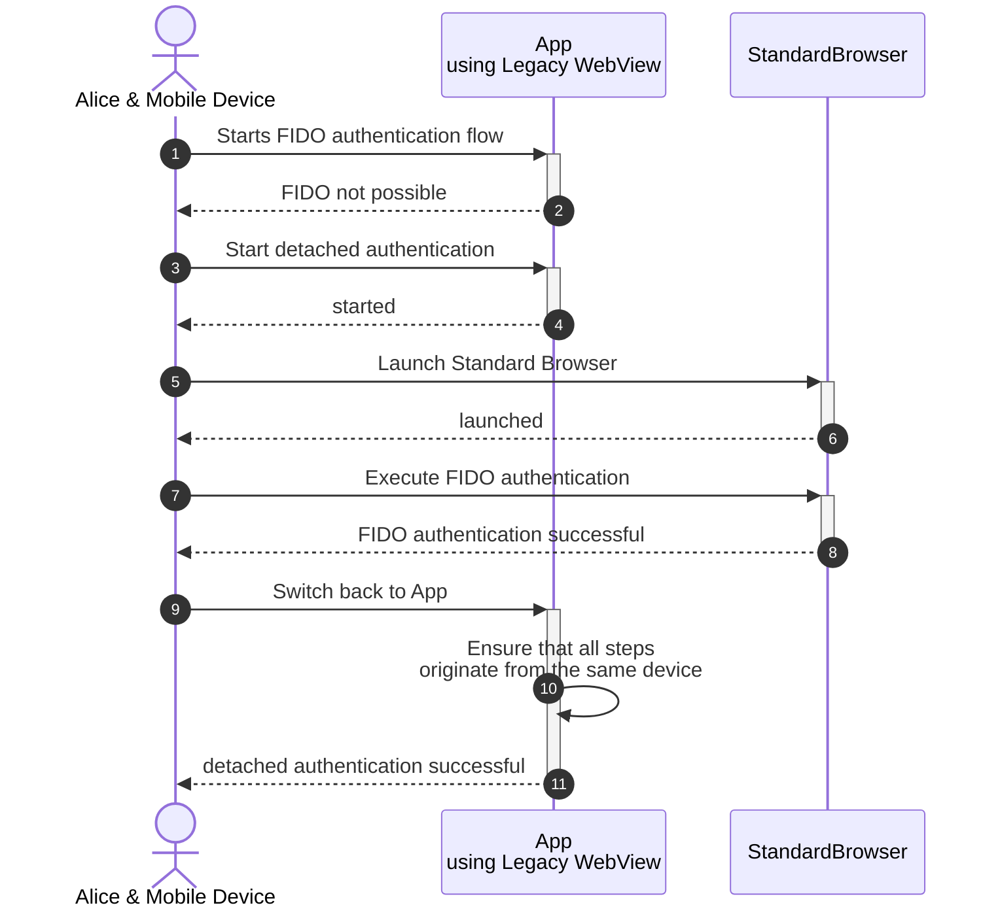
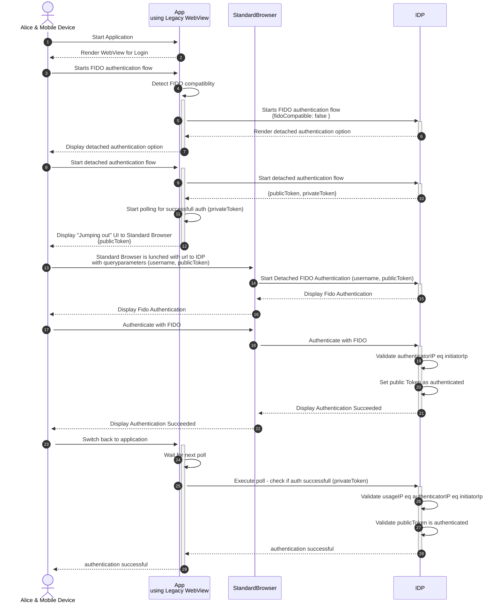

## TL;DR
We want to enforce FIDO-only to achieve phishing resistant authentication without the possibility of downgrade attacks. But many web-views in legacy applications do not support WebAuthn. 

Use case: How to enforce FIDO-only even if your users use mobile apps or desktop applications that contain legacy WebViews to render the authentication flow? 

We call it “Detached FIDO Authentication”: 

1. Provide the option to jump out of applications that use legacy WebViews (do not support WebAuthn) into the Operating System Standard Browser. 
2. Let the user execute FIDO authentication in the Operating System Standard Browser 
(modern Browsers support WebAuthn)
3. Let the user navigate back to the legacy WebView of the application
4. User is authenticated to the application if all steps of the flow were originating from the same device


This is a workaround until all apps which are relevant to us have integrated WebAuthn support. The workaround is not as user-friendly as WebAuthn directly from the application, but more secure than the alternative option of fallback to non-phishing resistant MFA methods like SMS, Push & Co.

## The long(er) story
### Background
During [our talk at the Authenticate 2022 Conference](https://authenticatecon.com/session/our-journey-to-implement-fido-in-a-global-science-technology-company/) we presented our journey on how we implement FIDO in a global science & technology company. It was about introducing the FIDO2 standard with the option to enforce FIDO-authenticator-registration with Identity-Verification and subsequently FIDO2-only authentication. We [mentioned](https://fidoalliance.org/authenticate-2022-day-3-recap/) that we eliminated a major road blocker to the enforcement of FIDO-only authentication. But we didn't explain the mechanism in detail. Let’s look into it.


### Challenge
FIDO 2.0 is an authentication framework. One part of that framework is the Web Authentication API (WebAuthn). This API is implemented by the majority of popular,modern browsers. One important and differentiating feature of FIDO authentication is phishing resistance. This can be utilised, if the WebAuthn API is implemented by the browser.

The FIDO authentication flow may be provided by an Identity Provider (IDP) for connected applications. It is often the case that IDPs offer different methods for authentication. If an IDP provides the opportunity for the user to choose between authentication mechanisms (e.g. FIDO, SMS OTP, Push Notification etc.) then the user is vulnerable to phishing attacks. This can be avoided if an IDP enforces FIDO only authentication.

If the IDP enforces FIDO only then the user must use a browser that implements the WebAuthn API. That is very likely no problem if the application in use is a regular web application which can be opened with a modern browser. The user can simply choose a browser that supports WebAuthn. 

Mobile apps and desktop applications can also authenticate via an IDP. This is typically done via an embedded WebView. The WebView is integrated into the application and cannot be replaced by the user. If the application uses a legacy WebView which does not support WebAuthn then the user cannot directly authenticate with FIDO. If the IDP enforces FIDO only then the user cannot use that application.

### Proposal for Workaround
“Detached FIDO Authentication” is triggered if an application does not support WebAuthn because it is using legacy WebViews for web-based authentication flows.

With the “Detached FIDO Authentication” flow it is possible to “jump” out of that WebAuthn-incompatible WebView and launch an instance of the OS standard browser. The OS standard browser is able to render the FIDO authentication flow and execute it, because OS standard browser has WebAuthn support. The “Detached FIDO Authentication” flow mandates an indicator that all steps from both the WebAuthn-incompatible WebView and the OS standard browser originate from the same device. This “same device” check prevents phishing of the WebAuthn-incompatible WebView portion of the process. After execution of the FIDO authentication inside of the OS standard browser the user navigates back to the application and is authenticated.

### High Level sequence diagram 


## Technical Approaches

### How to launch Standard Browser from WebView
There is no convenient “one-size-fits-all” solution to jump out of an application’s legacy WebView into the OS standard browser. Therefore client-side, JavaScript based fingerprinting should be used to determine the most appropriate approach for a “jumping out” technique that works with the device/application/WebView in use. 

To guarantee that Detached FIDO Authentication can be used, a robust fallback solution must also be implemented. The fallback solution is very likely not so convenient for the user but works everywhere: Simply show the link to be opened in an OS standard browser on the same device as text. For sure this needs to be well described and then the user can manually copy the text and open the link in their browser. One option is to expose  JavaScript Share and Copy Methods as buttons next to the link text.

Here are a few examples of convenient “jumping out” mechanisms that may be executed once the device details are known.

On Windows:
```
<a href=”microsoft-edge:https://example.com” target=”_blank”>Open</a>
```

On Android:
```
<a href="intent://example.com#Intent;scheme=https;action=android.intent.action.VIEW;end">Open</a>
```

On iOS:
```
<a href=”https://example.com” target=”_blank”>Open</a>

<a href=”googlechrome://example.com”>Open</a>

<a href=”shortcuts://run-shortcut?name=OpenUrl&input=text&text=example.com”>Open</a>

```

Disclaimer: These methods have not been tested on all apps and devices, but serve as an example of techniques that have proven useful in our deployment 😊.

### Validating that all steps of the flow originate from the same device
The Detached FIDO Authentication approach uses two loosely-coupled channels to achieve login. The first channel is the legacy WebView being used by the application (which does not support WebAuthn), and the second channel is the OS standard browser (which does support WebAuthn). In order to limit the opportunity for an attacker who has phished the victim into the application (first channel) and therefore is in control of the legacy WebView from to provide the FIDO authentication (second channel), it is desirable to try to ensure that both channels originate from the same device.

One simple approach for this validation is to store the IP Address of every step of the flow and validate that IP addresses from both channels are equal.

Disclaimer: There are edge cases where a phishing proxy server might have the same IP address as the browser who executes the FIDO authentication (e.g. both behind same NAT for whatever reason i.e. WLAN)

A mitigation for the NAT problem could be to enforce ipv6 connections for specific requests to your IDP, thus utilising the benefit that devices on the Internet are assigned a unique IP address for identification and location definition.

Another potential mitigation for the NAT problem could be that you are establishing a corporate VPN connection first with a fido-ready VPN app on your device.

Regardless, even simple IP-addressed based correlation offers significant benefits by preventing remote, distributed phishing campaigns.

### How to prevent authenticating the session of an attacker 
How can we prevent an attacker from convincing the victim to execute FIDO Authentication for the attacker’s session? We can also validate that IP Address from both channels are equal. To mitigate the problem that the attacker could have the same IP Address in some edge cases, we can ensure with WebRTC that both rendered websites are on the same device by creating a peer to peer connection and validating that the connected endpoint is on localhost.

### Setting and checking authentication state 
The Detached FIDO Authentication generates a private token and a public token. The public token is passed along with the url as a query parameter when opening the OS standard browser. After successful FIDO Authentication in the OS standard browser the public token is used to set the authentication state to success. The private token is used inside of the legacy WebView to check if the authentication state is successful. This check could be implemented e.g. via polling, WebSockets or Server-Sent Events. 

### Activate it only where necessary 
It is a good idea to limit the usage of the “Detached FIDO Authentication” flow only to the connected applications which utilise legacy WebViews and therefore need this flow. 

In SAML and OIDC authentication flows the IDP knows which application wants to authenticate the user. Therefore the IDP could offer a configuration option on the application entity which enables or disables the “Detached FIDO Authentication”.

If the application entity is a pure web application and no mobile app or desktop app, it is very likely that they won't need “Detached FIDO Authentication”. If the applications webview already supports webAuthn then “Detached FIDO Authentication” is also not necessary. Therefore it makes sense to fine granularity activate “Detached FIDO Authentication” only for applications which really need it.

### Detailed sequence diagram


## Summary
For sure “Detached FIDO Authentication” is not as secure and user-friendly as WebAuthn natively from a browser, however, from our point of view it is better than falling back to conventional, phishable MFA.

Having conventional MFA still in place as an option for the user means that users are vulnerable to downgrade attacks and can still be phished. 

There are many popular applications in the market today utilising WebViews that do not natively support WebAuthn. We cannot determine if and when vendors will upgrade their applications with WebAuthn-compatible user agents, and we cannot wait indefinitely for vendors to roll-out FIDO2 support. 

Independent of application readiness, we can now start the enforcement of FIDO-only authentication by utilising “Detached FIDO Authentication”. It remains a workaround but might be here to stay until all applications, which are relevant to us, have integrated WebAuthn support!
